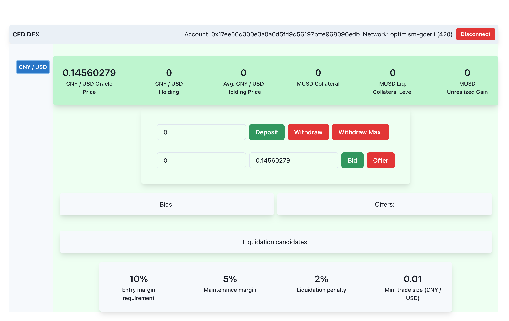

# Demo

## Video

Download the video [here](../doc/CFD%20DEX%20-%20HD%20720p.mov) or watch it on [YouTube](https://youtu.be/aPenvOYZz5Q).

## Deployments

For instructions on how to deploy the contracts and the front-end on a local development environment, as well as various testnets check [here](../HOWTO.md).

Most testnets lack the desired Chainlink price feed oracles. Also, it is hard to get large amounts of USDC on testnets for experimentation. To mitigate these problems we have created the following:
- A mock USD (IERC20 + "mint(uint256)") token with symbol MUSD. Anyone can call the method "mint(uint256 amount)" on the contract to mint any amount of MUSD (up to $2^{50}$). 
- A mock Chainlink-compatible (AggregatorV3Interface) oracle, which delivers a fixed price for CNY/USD. In order to experiment with the price dynamics, the contract CFDOrderBook provides a method "setMockPrice(uint256 price)" which can be called by anyone to set the oracle price to any value (in 8 decimal places). To reset it to the default value, call "setMockPrice(0)". 

The contract calls can be conveniently executed from the appropriate blockchain explorer.

This is how all the testned deployments look after connecting with a wallet:


Here are the deployed contract addresses and links to the appropriate IPFS pinned web3 apps (please be veeeery patient and refresh a couple of times, as I am hosting/pinning them from a slow connection):

 Gnosis Chiado ([web3 app here](https://bafybeifiszsclbtgvql752uoiy7zj6zyamma54qtvmme6fneya7cgz3vte.ipfs.dweb.link)):
```
MUSD: 0xe7a044e19D5afbB2957740a3Cdc3E295F152CF7E
MockPriceFeedOracle: 0x945923132F617Aa5d1bF4E6ea1baCa041Cc9fBEa
CFDOrderBookFactory: 0xaF4cF2Fdd4518615fCd7C82B1b4a9c5818296C26
CFDOrderBook for CNY/USD: 0xe0C7880061074fC21c4ce3CC9C1a9bF132462af1
FlashLiquidate for CNY/USD: 0x5213cA4f2dC60E925E8712d4b1f7d2D0976A5617
```

 Optimism Görli([web3 app here](http://bafybeib623jrtyf3gcxkhye3qlllepgsfne6a7lxvbw2xlzwfetaqeby5m.ipfs.dweb.link/)):
```
MUSD: 0xe7a044e19D5afbB2957740a3Cdc3E295F152CF7E
MockPriceFeedOracle: 0x945923132F617Aa5d1bF4E6ea1baCa041Cc9fBEa
CFDOrderBookFactory: 0xaF4cF2Fdd4518615fCd7C82B1b4a9c5818296C26
CFDOrderBook for CNY/USD: 0xe0C7880061074fC21c4ce3CC9C1a9bF132462af1
FlashLiquidate for CNY/USD: 0x5213cA4f2dC60E925E8712d4b1f7d2D0976A5617
```

 Scroll Alpha ([web3 app here](http://bafybeifydbrzsiclxrwmnihjpa2vfyvo7y4cnsyjjvmdjubcslug3vtj2q.ipfs.dweb.link/)):
```
MUSD: 0xe7a044e19D5afbB2957740a3Cdc3E295F152CF7E
MockPriceFeedOracle: 0x945923132F617Aa5d1bF4E6ea1baCa041Cc9fBEa
CFDOrderBookFactory: 0xaF4cF2Fdd4518615fCd7C82B1b4a9c5818296C26
CFDOrderBook for CNY/USD: 0xe0C7880061074fC21c4ce3CC9C1a9bF132462af1
FlashLiquidate for CNY/USD: 0x5213cA4f2dC60E925E8712d4b1f7d2D0976A5617
```

 Polygon zkEVM Testnet ([web3 app here](http://bafybeigpoj4bfyrlmlx3ggpm3xurumtsh6bomsn3cwxe3droir6lya6ti4.ipfs.dweb.link/)):
```
MUSD: 0x945923132F617Aa5d1bF4E6ea1baCa041Cc9fBEa
MockPriceFeedOracle: 0xaF4cF2Fdd4518615fCd7C82B1b4a9c5818296C26
CFDOrderBookFactory: 0x913d673428f0c24803EF612213d0760B5799C833
CFDOrderBook for CNY/USD: 0x7428F21D1Fd609B4FFcE31F75A7b7e233dE562aB
FlashLiquidate for CNY/USD: 0x47a9ebAF9b3C8aE77251249c3ab47FaF0bd46A2e
```

 Mantle Testnet ([web3 app here](http://bafybeibte2ed2t3ukc5cc6j2yoqdjfmfrgbqom5sm5wsfllb6b5lceqqly.ipfs.dweb.link/)):
```
MUSD: 0x5213cA4f2dC60E925E8712d4b1f7d2D0976A5617
MockPriceFeedOracle: 0x47a9ebAF9b3C8aE77251249c3ab47FaF0bd46A2e
CFDOrderBookFactory: 0xc41b5FF86Fc2250CfF87E573723220abC4e05578
CFDOrderBook for CNY/USD: 0x9ff069C602261b6D26C27D2827Bc9F324a88C474
FlashLiquidate for CNY/USD: 0x1d3f9dEB07dBC53dB803bAEAA412D4aaf012DA6e

```

 Taiko Alpha-2 ([web3 app here](http://bafybeibirx5o5fmri6cibp4vpeokyd7syztmfjkj2j6pyddxykvmvyyacy.ipfs.dweb.link/)):
```
MUSD: 0xd938f20F0B4D91f188710D7b407dfb1c40D5646A
MockPriceFeedOracle: 0xb412E9BFd4D10D2E0E98Bcd066f47682f84d8a03
CFDOrderBookFactory: 0xE6Bb8A1395d660b795264f790D4F2958aE5C10D5
CFDOrderBook for CNY/USD: 0x08186A43f9E541CCe4a00dee27cc532eF636479e
FlashLiquidate for CNY/USD: 0x27979b33BAc1f327C13B693Bd7804B53f86C1457

```

 zkSync Era Testnet :

This is work in progress. The contracts can be compiled manually, but I have not managed to set up the Foundry toolkit to use the zkSync Era Solidity LLVM compiler.
